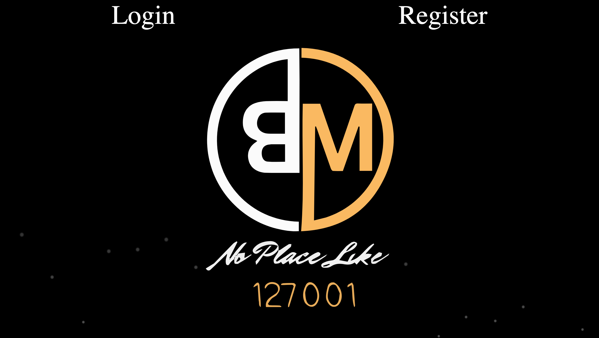
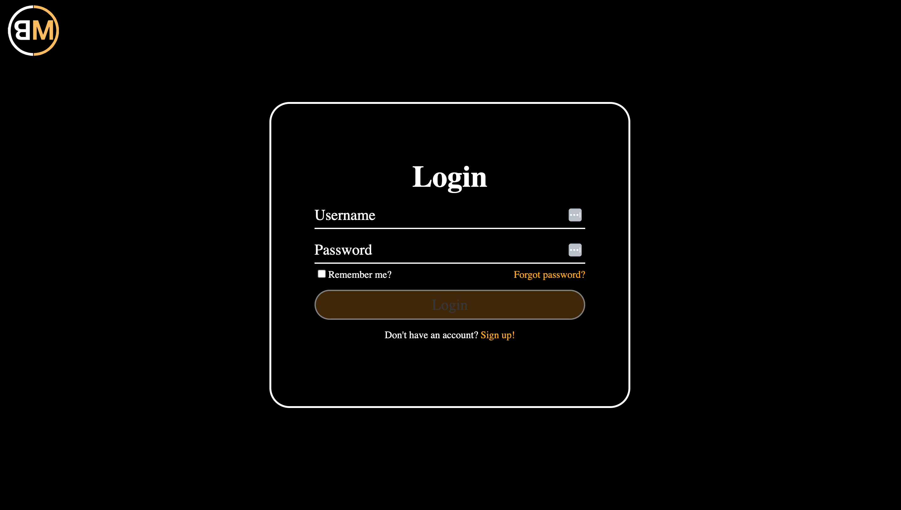
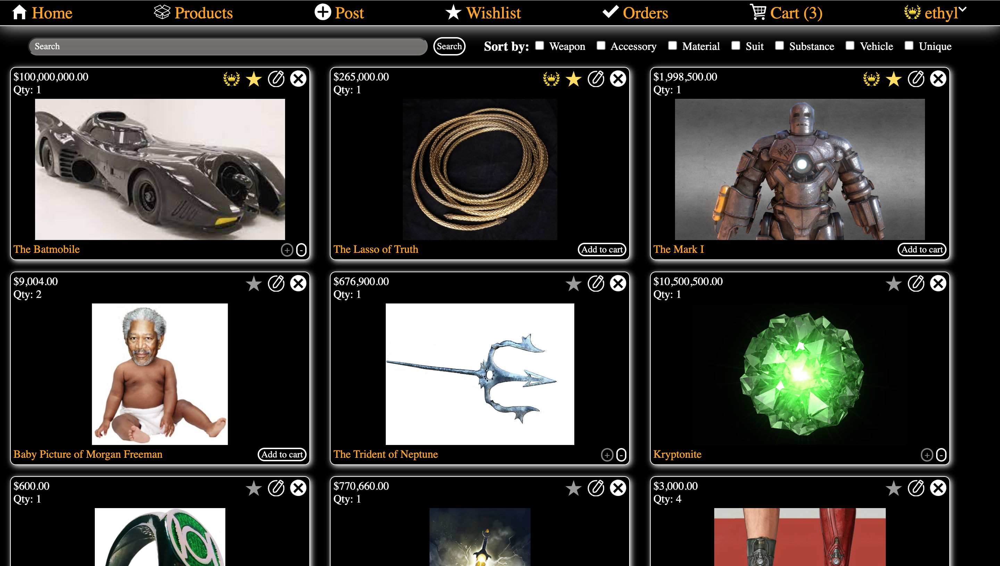
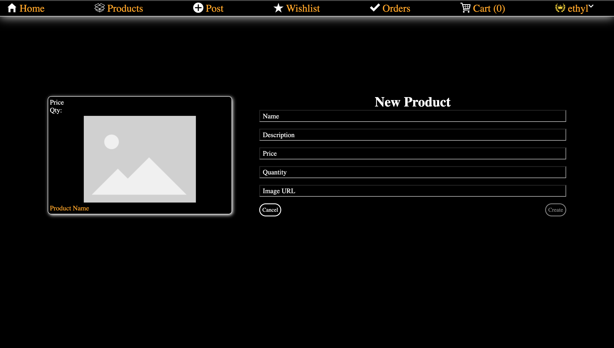
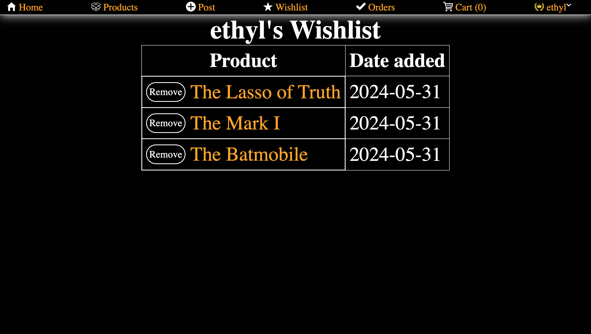
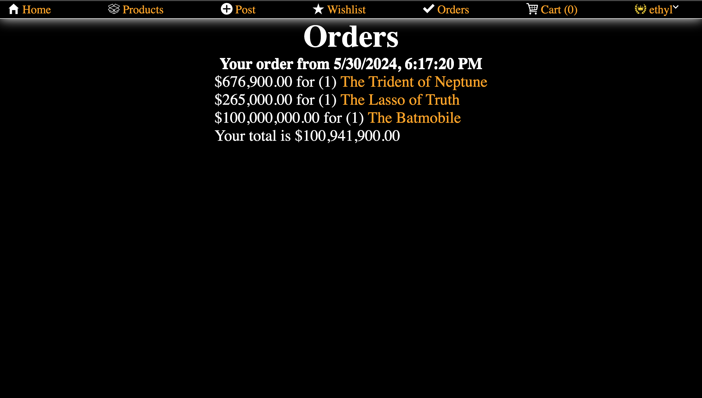
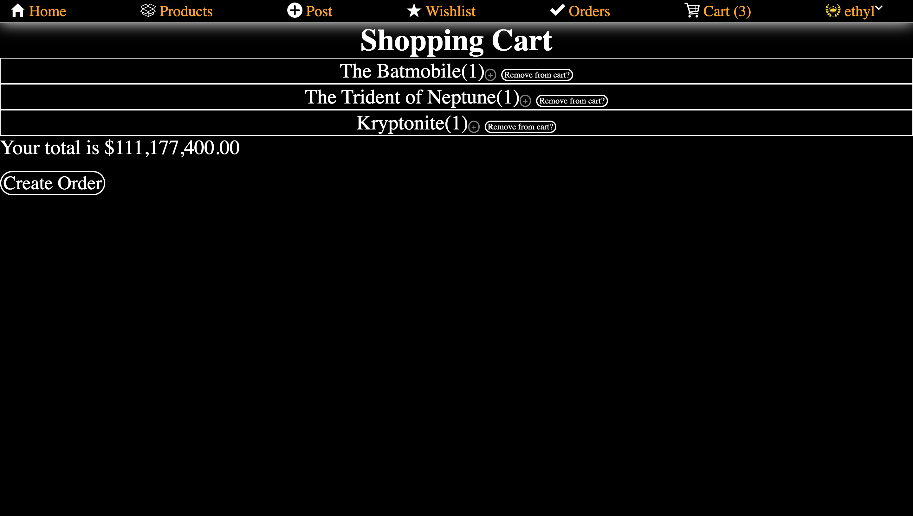

<h1 align='center'>The Black Market</h1>
 
<h2>About the project</h2>

This is a ecommerce website with the ability to supply you with any superhero weapon It was built with vanilla JavaScript and CSS.

Live Demo: <a href='https://black-market-50e6.onrender.com/#/'>Black Market Demo</a>
- User: Ethyl
- Pass: 1234

<h2>Screenshots of the project</h2>
 
<h3 align='center'>Home Page</h3>

  
<h3 align='center'>Login Page</h3>

  
<h3 align='center'>Products Page</h3>

  
<h3 align='center'>New Product Page</h3>

  
<h3 align='center'>Wishlist Page</h3>

  
<h3 align='center'>Orders Page</h3>

  
<h3 align='center'>Cart Page</h3>

  
